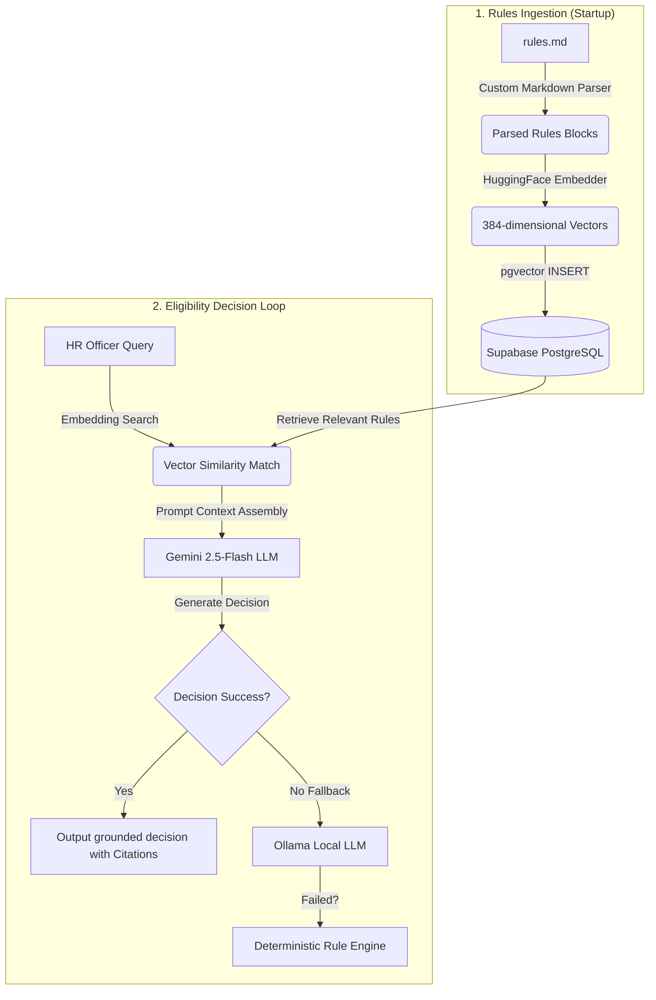

<div align="center">


# 🚂 RailVera Workspace

### *Indian Railways Departmental Decision Support & Eligibility System*

[](https://www.python.org)
[](https://fastapi.tiangolo.com)
[](https://nextjs.org)
[](https://www.postgresql.org)
[](https://deepmind.google/technologies/gemini)

**RailVera** is an advanced AI-powered personnel decision support portal designed for **HR and Personnel Officers** in the Indian Railways. It reads, parses, vectorizes, and queries complex departmental rules to automate promotion, leave, and transfer eligibility evaluations.

</div>

---

## 🏗 System Architecture & Workflow

Here is how the RAG (Retrieval-Augmented Generation) pipeline processes rules from the workspace root to generate grounded decisions:



---

## 📁 Workspace Map

The workspace contains both the core datasets and the codebase:

| Resource / Directory | Description |
| :--- | :--- |
| **[`rules.md`](file:///c:/Users/Navami/project/RailVera/rules.md)** | The complete rulebook dataset containing leave, promotion, and transfer policies. |
| **[`railway-admin-ai/`](file:///c:/Users/Navami/project/RailVera/railway-admin-ai)** | The application package consisting of the Next.js frontend and FastAPI backend. |
| **[`Railway_Admin_AI_Master_Prompt_v2.md`](file:///c:/Users/Navami/project/RailVera/Railway_Admin_AI_Master_Prompt_v2.md)** | Master specification prompt detailing prompt structures and domain rules. |

---

## ✨ Key Features

* 🤖 **Double-Grounded RAG**: Combines vector database semantic search with a rules-based logical engine to completely avoid AI hallucinations.
* 📄 **Document Intelligence**: Deep OCR parsing of scanned railway Service Books, APARs, and Medical Certificates.
* 🛡️ **JWT Security**: Role-based access control segregating Personnel Officers from general Employees.
* 📜 **Automated PDF Reports**: Instant download of official generated eligibility PDF reports signed and ready for administrative filing.

---

## 🚀 Quick Setup & Run

Ensure you have configured your environment variables inside `railway-admin-ai/backend/.env` before launching.

### 1. Launch the Backend API
```bash
cd railway-admin-ai/backend
python -m venv .venv
# Activate virtual environment
# Windows:
.venv\Scripts\activate
# macOS/Linux:
source .venv/bin/activate

# Install dependencies
pip install -r requirements.txt

# Run FastAPI backend
python -m uvicorn app.main:app --reload --host 0.0.0.0 --port 8000
```

### 2. Launch the Web Portal
```bash
cd railway-admin-ai/frontend
npm install
npm run dev
```
Open [http://localhost:3000](http://localhost:3000) to view the portal.

---

<div align="center">
Developed for the Indian Railways Personnel Department.
</div>
